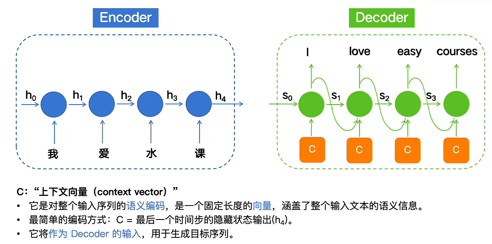
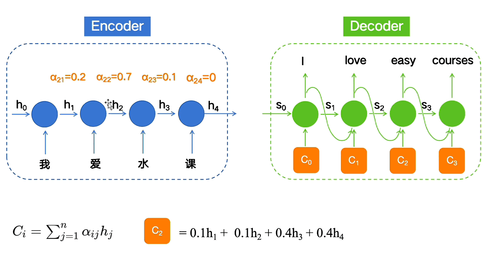

# Transformer架构
## 论文地址
https://arxiv.org/abs/1706.03762
## 概述
本文包含对于Transformer架构机制的完整描述，在本人通读论文后进行详细梳理，整理成适合初学者阅读的方式，便于Transformer架构入门
## 前言
你需要具备的基础知识
- FNN（前馈神经网络）
- RNN（循环神经网络）
- Encoder-Decoder（编码器-解码器架构）
- Attention（注意力机制）
## 背景
### FNN

#### 解决
- 处理固定长度输入 → 固定长度输出的问题
- 建立输入特征与输出之间的非线性映射关系
#### 问题
- 数据单向传播（无记忆能力）
- 完全丢失顺序的信息
### RNN

#### 改进
- 能够处理词序
- 能够保留上下文信息
- 能够支持不定长信息输入
#### 问题
- 长期记忆缺失
- 输入输出长度必须一致
### Encoder-Decoder

#### 解决
- 处理输入序列长度 ≠ 输出序列长度的问题
- 解决Seq2Seq（序列到序列）任务
#### 改进
- Encoder：把输入序列压缩成一个“上下文向量”
- Decoder：根据该向量生成目标序列
#### 问题
- 处理长序列信息时会有遗忘
- 不同时间步的输入对输出的重要性相同，无法进行影响性的倾斜
### Attention

#### 改进
- 对每一个token的重要性进行了调整，使得预测的token权重进行修改