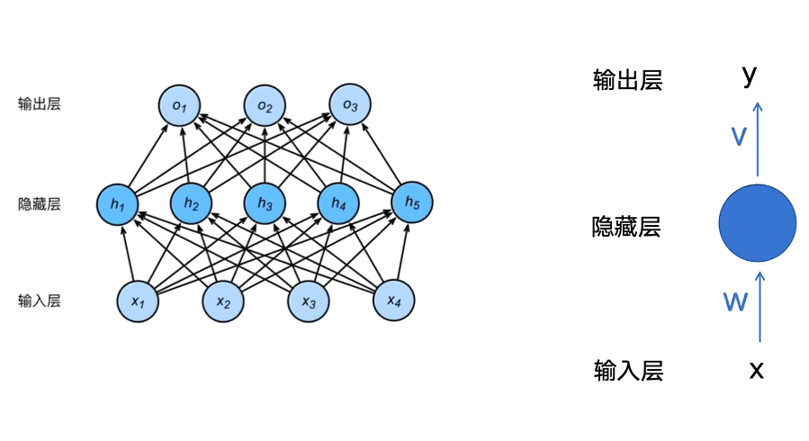
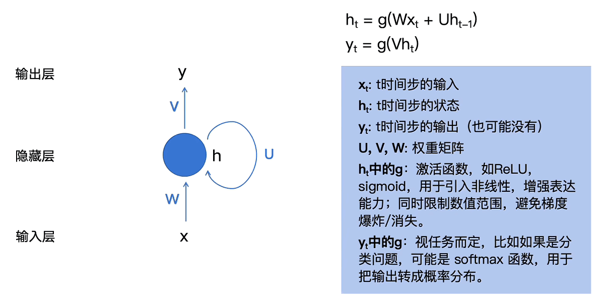
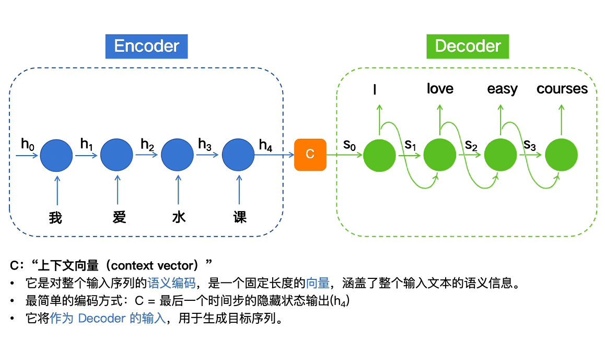

# Transformer架构
## 论文地址
https://arxiv.org/abs/1706.03762
## 概述
本文包含对于Transformer架构机制的完整描述，在本人通读论文后进行详细梳理，整理成适合初学者阅读的方式，便于Transformer架构入门
## 前言
你需要具备的基础知识
- FNN（前馈神经网络）
- RNN（循环神经网络）
- Encoder-Decoder（编码器-解码器架构）
- Attention（注意力机制）
## 背景
### FNN

#### 解决
- 处理固定长度输入 → 固定长度输出的问题
- 建立输入特征与输出之间的非线性映射关系
#### 问题
- 只能处理固定长度的输入与输出
- 数据单向传播（无记忆能力）
- 完全丢失顺序的信息
### RNN

#### 改进
- 能够处理词序
- 能够保留上下文信息
- 能够支持不定长信息输入
#### 问题
- 长期记忆缺失（梯度消失/爆炸）
- 输入输出长度必须一致（经典RNN）
- 只能串行计算，无法并行计算
### Encoder-Decoder

#### 解决
- 处理输入序列长度 ≠ 输出序列长度的问题
#### 改进
- Encoder：把输入序列压缩成一个context vector
- Decoder：根据该向量生成目标序列
#### 问题
- 处理长序列信息时会有遗忘（早期token信息被覆盖）
- 不同时间步的输入对输出的重要性相同，无法倾斜影响
### Attention

#### 改进
- 生成每一个输出token时，动态计算输入序列各token的权重
#### 问题
- 图片中的是旧的注意力计算公式，K=V，存在两个向量越相似则内容越重要这个先验假设
## 以往研究存在的问题
改进都是基于RNN架构，所以只能串行计算，无法并行计算
## Transformer架构

### Input
- 分词器（Tokenizer）
- 高维向量嵌入（Input Embedding）
- 叠加token位置编码（Positional Encoding）